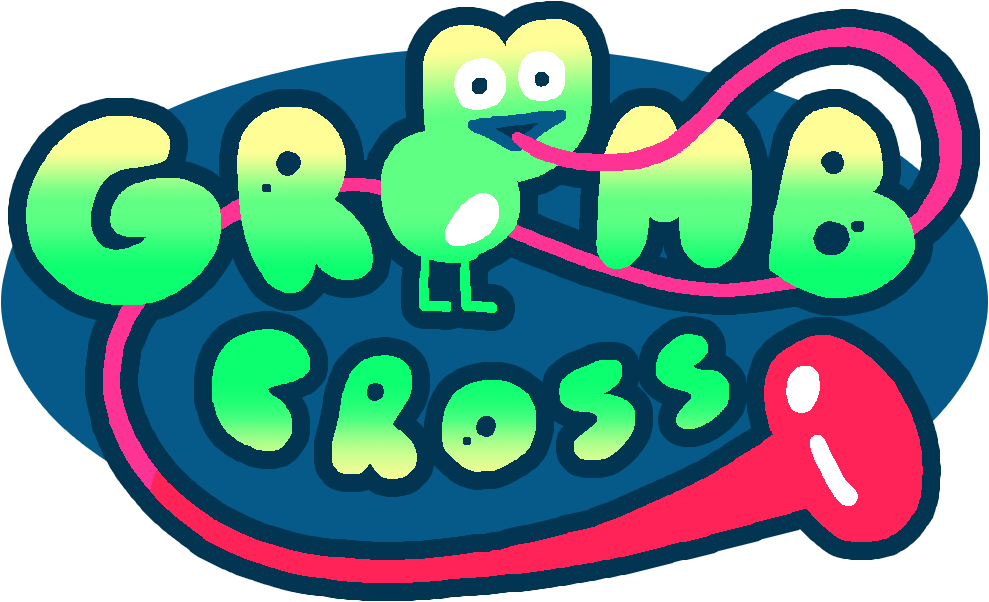
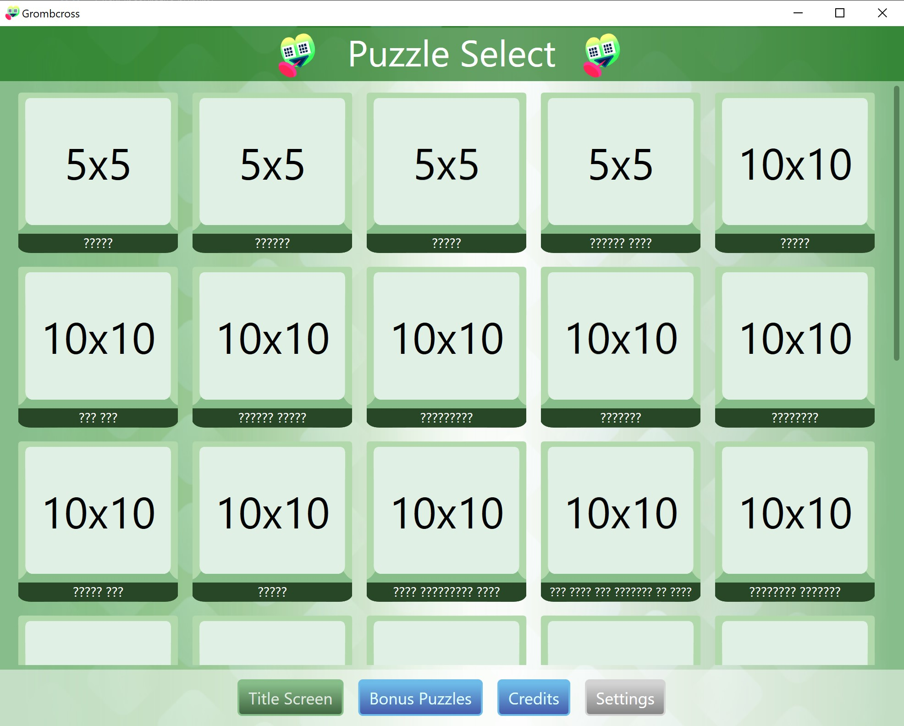
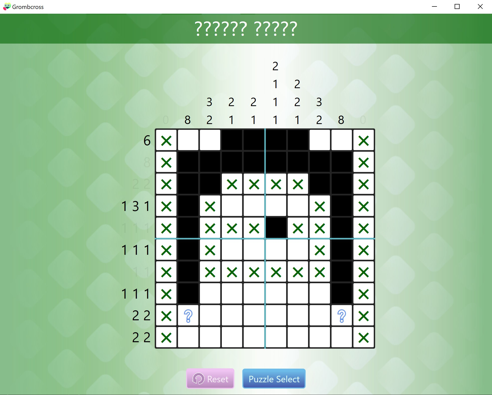

# Grombcross
A picross game for the Dallas Society of Play!

Each of the standard puzzles is a different piece of DSOP lore. There are also a variety of bonus puzzles included that are completely random.
As of v1.0, there are 33 standard puzzles and 19 bonus puzzles

Created using WPF, .NET 6, C#, Visual Studio 2022, and Paint.net

## Team
* Sammy Mahmoudi - Team Lead, Programming, Puzzle Design
* Miles Gentry - Music, SFX
* Michael Bravo - UI Art
* Kris Olivares - Puzzle Design, Memes
* FIZZTAP - Icon, Title Graphic, Grombit Character

## Adding custom puzzles
### In the download folder, there is a Puzzles folder with all the puzzle images. Here, you can edit any of the puzzles or even add your own if you follow some rules!
* Images must be bitmap format.
* The naming convention is "<Puzzle Index>-<Puzzle Name>-<G or F>"
* Each puzzle is a pair of images: 'G' image is the generation image (black and white one) and 'F' image is the full color image.
* Puzzles must be square, and the 'G' and 'F' images for the same puzzle must be the same exact dimensions.